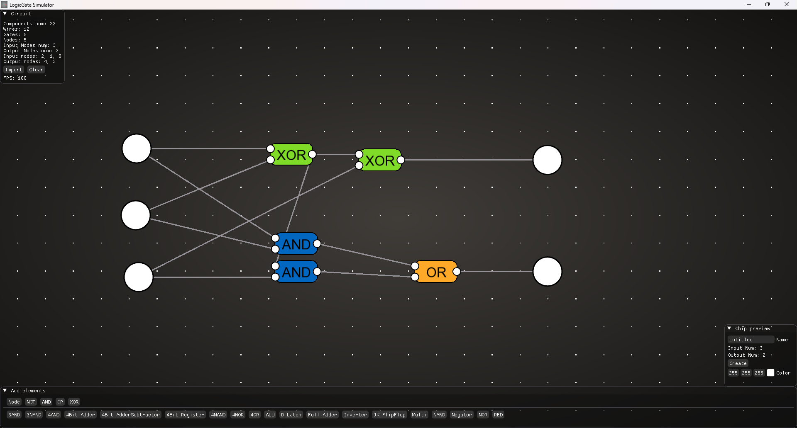

# Logic Gate Simulator

  

A **C++ logic circuit simulator** built with **ImGui** and **SFML**, designed for easy creation, testing, and management of digital logic circuits.  
Supports saving/loading circuits, and exporting them as reusable **chips/custom gates**.

---

## Features

- **Real-time Circuit Editing**: Drag, drop, and connect logic gates interactively.  
- **Gate Types**: AND, OR, NOT, XOR, NAND, NOR, XNOR, and more.  
- **Save & Load Circuits**: Preserve your work in a compact save format.  
- **Custom Gates / Chips**: Convert completed circuits into reusable modules.  
- **Intuitive UI**: Powered by **ImGui** for menus, panels, and property editing.  
- **Visual Feedback**: Live propagation of signals through your circuit.

---

## Usage

1. **Launch Simulator**  
   Run the compiled executable; a window will appear showing the workspace.  

2. **Create Circuits**  
   - Add gates via the panel.  
   - Connect inputs/outputs by dragging wires between nodes.  

3. **Simulation**  
   - Toggle input signals to see real-time propagation.  
   - Debug or test different logic configurations easily.  

4. **Save / Load**  
   - Save your current circuit to a file.  
   - Load previously saved circuits to continue editing.  

5. **Export as Custom Chip**  
   - Convert any circuit into a reusable **chip**.  
   - Use chips in other circuits like standard gates.

---

## Integration Notes

- Built on **SFML** for rendering and input handling.  
- **ImGui** manages the interface for menus, panels, and node properties.  
- Save files are plain JSON or binary (depending on implementation) for portability.  
- Custom chip files can be loaded back as a single node in new circuits.

---

## Summary

This project provides a **flexible, interactive environment for digital logic experimentation**.  
Ideal for learning, testing ideas, or creating modular logic systems that scale with custom chips.
